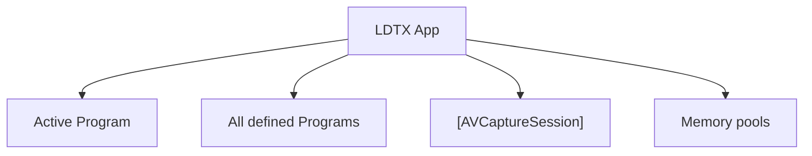

<!--
SPDX-FileCopyrightText: 2026 Kaito Udagawa <umireon@kaito.tokyo>

SPDX-License-Identifier: Apache-2.0
-->

# Class Model

This document sketches the top-level lifecycle structure of LDTX.

## Active Program

Active Program is the Main stream screen. It can be shown on the Preview screen, recorded, or streamed.

All defined Programs only exist as available definitions. A Program gains runtime management responsibility when it is promoted to Active Program.

Active Program is responsible for the areas and resources needed by the active Program. For now, Active Program owns all runtime management responsibility except `[AVCaptureSession]`.

Memory ownership still ends at Memory pools. Active Program does not need to strictly own the lifetime of individual memory allocations.

## Memory pools

Memory pools have the same lifecycle as the app window. They hold `CVPixelBufferPool` instances and vend `CVPixelBuffer` values from those pools.

Different Programs and components can require different pixel-buffer settings.
Memory pools receive requests from Programs or components, prepare matching `CVPixelBufferPool` instances, and provide buffers when needed.

Individual `CVPixelBuffer` lifetime is handled by Core Video reference counting, so LDTX does not need its own buffer reference counting for now.
