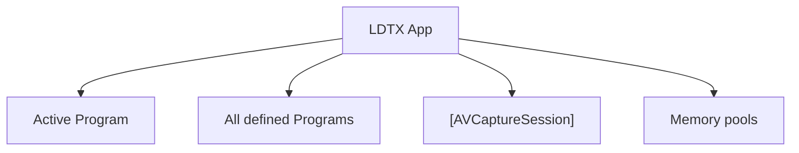

<!--
SPDX-FileCopyrightText: 2026 Kaito Udagawa <umireon@kaito.tokyo>

SPDX-License-Identifier: Apache-2.0
-->

# Class Model

This document sketches the top-level lifecycle structure of LDTX.

## Active Program

Active Program is the Main stream screen. It can be shown on the Preview screen, recorded, or streamed.

All defined Programs only exist as available definitions. A Program gains runtime management responsibility when it is promoted to Active Program.

Active Program is responsible for the areas and resources needed by the active Program. For now, Active Program owns all runtime management responsibility except `[AVCaptureSession]`.

Memory ownership still ends at Memory pools. Active Program does not need to strictly own the lifetime of individual memory allocations.

## Memory pools

Memory pools have the same lifecycle as the app window. They hold `CVPixelBufferPool` instances and vend `CVPixelBuffer` values from those pools.

Different Programs and components can require different pixel-buffer settings.
Memory pools receive requests from Programs or components, prepare matching `CVPixelBufferPool` instances, and provide buffers when needed.

Individual `CVPixelBuffer` lifetime is handled by Core Video reference counting, so LDTX does not need its own buffer reference counting for now.

## Concurrency and callback policy

Swift Package modules provide synchronous APIs by default. They do not choose
an executor or introduce parallelism on behalf of the app unless an underlying
framework requires asynchronous delivery.

Use APIs in this order of preference:

1. synchronous methods;
2. delegate or protocol callbacks for streams of external events;
3. completion-handler methods for operations that finish later; and
4. `async` APIs only when the dependency has no synchronous, delegate, or
   completion-handler equivalent.

When a framework provides equivalent `async` and completion-handler variants,
Package code must use the completion-handler variant. Package modules do not
publish convenience `async` wrappers. The app and UI layers may wrap a
completion-handler API in `async`/`await` when that makes an interaction flow
clearer.

Media data follows an additional ownership rule. A `CMSampleBuffer`,
`CVPixelBuffer`, `CVMetalTexture`, or other reference to shared media storage
must not cross a concurrency boundary merely by being captured in an escaping
closure, stored in a continuation, or hidden in an `@unchecked Sendable`
wrapper. A media stage must instead do one of the following:

- borrow the buffer synchronously on the stage's documented queue;
- retain it in explicit in-flight state until the downstream consumer reports
  completion; or
- repack it into storage whose ownership belongs to the downstream stage.

Completion handlers communicate completion, errors, identifiers, and immutable
summary values. They should not transport media buffers. Each completion
handler must be invoked exactly once, and its callback queue must be part of the
API contract.
